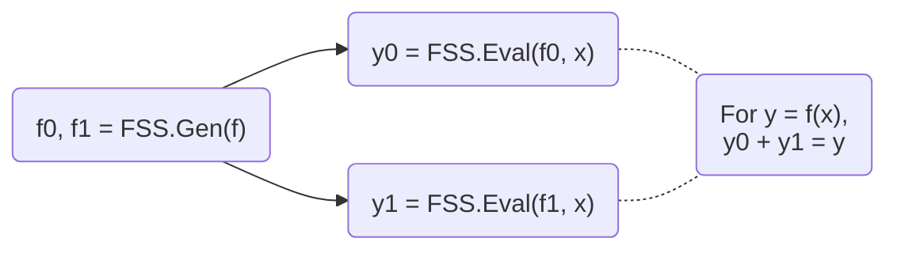

# myl7/fss

Function secret sharing (FSS) primitives including:

- 2-party distributed point function (DPF), based on [Boyle et al. (CCS '16)](https://doi.org/10.1145/2976749.2978429) or [Half-Tree (EUROCRYPT '23)](https://doi.org/10.1007/978-3-031-30545-0_12).
- 2-party distributed comparison function (DCF), based on [Boyle et al. (EUROCRYPT '21)](https://doi.org/10.1007/978-3-030-77886-6_30) or [Grotto (CCS '23)](https://doi.org/10.1145/3576915.3623147).
- 2-party verifiable distributed point function (VDPF), based on [Castro & Polychroniadou (EUROCRYPT '22)](https://doi.org/10.1007/978-3-031-06944-4_6).
- 2-party verifiable distributed multi-point function (VDMPF), based on [Castro & Polychroniadou (EUROCRYPT '22)](https://doi.org/10.1007/978-3-031-06944-4_6).
- 2-pary distributed multi-point function (DMPF), the non-verifiable counterpart of VDMPF.

[Documentation](https://myl7.github.io/fss/)

Features:

- First-class support for GPU (based on CUDA)
- Top-tier performance shown by benchmarks
- Well-commented and documented
- Header-only library, easy for integration

## Introduction

**Multi-party computation (MPC)** is a subfield of cryptography that aims to enable a group of parties (e.g., servers) to jointly compute a function over their inputs while keeping the inputs private.

**Secret sharing** is a method that distributes a secret among a group of parties, such that no individual party holds any information about the secret.
For example, a number $x$ can be secret-shared into $x_0, x_1$ via $x = x_0 + x_1$.

**FSS** is a scheme to secret-share a function into a group of function shares.
Each function share, called as a **key**, can be individually evaluated on a party.
The outputs of the keys are the shares of the original function output.
FSS consists of 2 methods: `Gen` for generating function shares as keys and `Eval` for evaluating a key to get an output share.
FSS's workflow is shown below:



**DPF/DCF** are FSS for point/comparison functions.
They are called out because 2-party DPF/DCF can have $O(\log N)$ key size, where $N$ is the input domain size.
Meanwhile, 3-or-more-party DPF/DCF and general FSS have $O(\sqrt{N})$ key size.
More details, including the definitions and the implementation details that users must care about, can be found in the documentation of dpf.cuh and dcf.cuh files.

## Get Started

### Prerequisites

- CMake >= 3.22
- CUDA toolkit >= 12.0 (for C++20 support). Tested on the latest CUDA toolkit.
- OpenSSL 3 (only required for CPU with AES-128 MMO PRG)

### Build

Clone the repository:

```bash
git clone https://github.com/myl7/fss.git
cd fss
```

**Option A: Install via CMake and use `find_package`**

```bash
cmake -B build -DBUILD_TESTING=OFF -DCMAKE_INSTALL_PREFIX=/path/to/install
cmake --build build
cmake --install build
```

Then in your project's `CMakeLists.txt`:

```cmake
find_package(fss REQUIRED)
target_link_libraries(your_target fss::fss)
```

When configuring your project, point CMake to the install prefix:

```bash
cmake -B build -DCMAKE_PREFIX_PATH=/path/to/install
```

**Option B: Use as a subdirectory (header-only)**

Without installing, you can define the target directly in your `CMakeLists.txt`, like the samples do:

```cmake
add_library(fss INTERFACE)
target_include_directories(fss INTERFACE "/path/to/fss/include")
target_compile_features(fss INTERFACE cxx_std_20 cuda_std_20)
```

Then link it in your project:

```cmake
target_link_libraries(your_target fss)
```

### CPU

This walks through using DPF and DCF on the CPU with AES-128 MMO PRG. This PRG requires OpenSSL.

1. Include the headers and set up type aliases:

   ```cpp
   #include <fss/dpf.cuh>
   #include <fss/dcf.cuh>
   #include <fss/group/bytes.cuh>
   #include <fss/prg/aes128_mmo.cuh>

   constexpr int kInBits = 8;  // Input domain: 2^8 = 256 values
   using In = uint8_t;
   using Group = fss::group::Bytes;

   // DPF uses mul=2, DCF uses mul=4
   using DpfPrg = fss::prg::Aes128Mmo<2>;
   using DcfPrg = fss::prg::Aes128Mmo<4>;
   using Dpf = fss::Dpf<kInBits, Group, DpfPrg, In>;
   using Dcf = fss::Dcf<kInBits, Group, DcfPrg, In>;
   ```

2. Create the PRG with AES keys and instantiate DPF/DCF:

   ```cpp
   // DPF PRG needs 2 AES keys
   unsigned char key0[16] = {1, 2, 3, 4, 5, 6, 7, 8, 9, 10, 11, 12, 13, 14, 15, 16};
   unsigned char key1[16] = {16, 15, 14, 13, 12, 11, 10, 9, 8, 7, 6, 5, 4, 3, 2, 1};
   const unsigned char *keys[2] = {key0, key1};
   auto ctxs = DpfPrg::CreateCtxs(keys);

   DpfPrg prg(ctxs);
   Dpf dpf{prg};
   ```

3. Run `Gen` to generate correction words (keys) from secret inputs:

   ```cpp
   In alpha = 42;                  // Secret point / threshold
   int4 beta = {7, 0, 0, 0};      // Secret payload (LSB of .w must be 0)

   // Random seeds for the two parties (LSB of .w must be 0)
   int4 seeds[2] = {
       {0x11111111, 0x22222222, 0x33333333, 0x44444440},
       {0x55555555, 0x66666666, 0x77777777, static_cast<int>(0x88888880u)},
   };

   Dpf::Cw cws[kInBits + 1];
   dpf.Gen(cws, seeds, alpha, beta);
   ```

4. Run `Eval` on each party and reconstruct using the group:

   ```cpp
   // Each party evaluates independently
   int4 y0 = dpf.Eval(false, seeds[0], cws, alpha);
   int4 y1 = dpf.Eval(true, seeds[1], cws, alpha);

   // Reconstruct via the group: convert to group elements, add, convert back
   // For Bytes group this is XOR; for Uint group this is arithmetic addition
   int4 sum = (Group::From(y0) + Group::From(y1)).Into();
   // sum == beta at x == alpha, 0 otherwise
   ```

5. Free the AES contexts when done:

   ```cpp
   DpfPrg::FreeCtxs(ctxs);
   ```

DCF follows the same pattern — use `DcfPrg` (mul=4, needs 4 AES keys), `Dcf`, and `Dcf::Cw`. The reconstructed output equals `beta` when `x < alpha` and `0` otherwise.

Link with OpenSSL in your `CMakeLists.txt`:

```cmake
find_package(OpenSSL REQUIRED)
target_link_libraries(your_target fss OpenSSL::Crypto)
```

See `samples/dpf_dcf_cpu.cu` for the complete working example.

### GPU

This walks through using DPF and DCF on the GPU with ChaCha PRG.

1. Include the headers and set up type aliases:

   ```cpp
   #include <fss/dpf.cuh>
   #include <fss/dcf.cuh>
   #include <fss/group/bytes.cuh>
   #include <fss/prg/chacha.cuh>

   constexpr int kInBits = 8;
   using In = uint8_t;
   using Group = fss::group::Bytes;

   // DPF uses mul=2, DCF uses mul=4
   using DpfPrg = fss::prg::ChaCha<2>;
   using DcfPrg = fss::prg::ChaCha<4>;
   using Dpf = fss::Dpf<kInBits, Group, DpfPrg, In>;
   using Dcf = fss::Dcf<kInBits, Group, DcfPrg, In>;
   ```

2. Set up a nonce in constant memory and create the PRG in a kernel:

   ```cpp
   __constant__ int kNonce[2] = {0x12345678, 0x9abcdef0};

   __global__ void GenKernel(Dpf::Cw *cws, const int4 *seeds, const In *alphas, const int4 *betas) {
       int tid = blockIdx.x * blockDim.x + threadIdx.x;

       DpfPrg prg(kNonce);
       Dpf dpf{prg};

       int4 s[2] = {seeds[tid * 2], seeds[tid * 2 + 1]};
       dpf.Gen(cws + tid * (kInBits + 1), s, alphas[tid], betas[tid]);
   }
   ```

3. Prepare host data, copy to device, and launch the `Gen` kernel:

   ```cpp
   int4 *d_seeds = /* cudaMalloc + cudaMemcpy seeds to device */;
   In *d_alphas = /* cudaMalloc + cudaMemcpy alphas to device */;
   int4 *d_betas = /* cudaMalloc + cudaMemcpy betas to device */;

   Dpf::Cw *d_cws;
   cudaMalloc(&d_cws, sizeof(Dpf::Cw) * (kInBits + 1) * N);

   GenKernel<<<blocks, threads>>>(d_cws, d_seeds, d_alphas, d_betas);
   ```

4. Write and launch an `Eval` kernel for each party, then copy results back:

   ```cpp
   __global__ void EvalKernel(int4 *ys, bool party, const int4 *seeds, const Dpf::Cw *cws, const In *xs) {
       int tid = blockIdx.x * blockDim.x + threadIdx.x;

       DpfPrg prg(kNonce);
       Dpf dpf{prg};

       ys[tid] = dpf.Eval(party, seeds[tid], cws + tid * (kInBits + 1), xs[tid]);
   }

   // Launch for party 0 and party 1, then copy d_ys back to host
   EvalKernel<<<blocks, threads>>>(d_ys, false, d_seeds0, d_cws, d_xs);
   EvalKernel<<<blocks, threads>>>(d_ys, true, d_seeds1, d_cws, d_xs);
   ```

5. Reconstruct on the host using the group, same as the CPU case:

   ```cpp
   int4 sum = (Group::From(h_y0s[i]) + Group::From(h_y1s[i])).Into();
   ```

DCF follows the same pattern — use `DcfPrg` (mul=4), `Dcf`, and `Dcf::Cw`.

See `samples/dpf_dcf_gpu.cu` for the complete working example.

### Samples

`samples/` holds a standalone program per scheme. They form their own CMake project:

```bash
cmake -B build/samples -S samples
cmake --build build/samples
```

| Sample                 | Scheme        | Shows                                                                |
| ---------------------- | ------------- | -------------------------------------------------------------------- |
| `dpf_dcf_cpu.cu`       | DPF, DCF      | Host `Gen`/`Eval` with AES-128 MMO PRG                               |
| `dpf_dcf_gpu.cu`       | DPF, DCF      | `Gen`/`Eval` inside CUDA kernels with ChaCha PRG                     |
| `half_tree_dpf_cpu.cu` | Half-Tree DPF | `Gen`/`Eval`/`EvalAll` with a mul=1 PRG and a separate hash key      |
| `grotto_dcf_cpu.cu`    | Grotto DCF    | `Gen`/`Preprocess`/`Eval` over a parity segment tree, plus `EvalAll` |
| `vdpf_cpu.cu`          | VDPF          | `Gen`/`Eval` plus the `Prove`/`Verify` check                         |
| `vdmpf_cpu.cu`         | VDMPF         | `Gen`/`BatchEval` over cuckoo-hash packed points                     |
| `dmpf_cpu.cu`          | DMPF          | `Gen`/`BatchEval` over cuckoo-hash packed points, without verification

The CPU samples link OpenSSL, and `EvalAll` uses OpenMP when it is found.

### Python

The `fss_crypto` package exposes PyTorch wrappers for DPF and DCF. It is
published on PyPI as `fss-crypto`.

Install it with pip:

```bash
pip install fss-crypto
```

Or add it to a uv project:

```bash
uv add fss-crypto
```

The package requires Python >= 3.13 and PyTorch >= 2.6. The first use of each
parameter set JIT-compiles a small CUDA extension with
`torch.utils.cpp_extension.load`, so the CUDA toolkit is required even when the
example below runs on CPU tensors. The `aes128_mmo` PRG also links OpenSSL at
JIT time. Compiled extensions are cached under `~/.cache/fss_crypto`.

To develop against a checkout instead, install the dev extra and run the tests:

```bash
uv sync --extra dev
uv run pytest
```

```python
import torch
import fss_crypto

dpf = fss_crypto.Dpf(in_bits=8, group="bytes", prg="chacha")

s0s = torch.tensor(
    [
        [0x11111111, 0x22222222, 0x33333333, 0x44444440],
        [0x55555555, 0x66666666, 0x77777777, -0x77777780],
    ],
    dtype=torch.int32,
)
beta = torch.tensor([7, 0, 0, 0], dtype=torch.int32)

cws = dpf.gen(s0s, alpha=42, beta=beta)
y0 = dpf.eval(party=0, s0=s0s[0], cws=cws, x=42)
y1 = dpf.eval(party=1, s0=s0s[1], cws=cws, x=42)

assert torch.bitwise_xor(y0, y1).equal(beta)
```

`gen` and `eval_all` are CPU-only. `eval` can run on CUDA tensors for ChaCha
PRG when CUDA is available. The JIT path sets a default `TORCH_CUDA_ARCH_LIST`
on machines with no visible GPU so CPU tests can still compile the extension.

### Compiler Warnings

You may see warnings like "integer constant is so large that it is unsigned" during compilation. These cannot be easily suppressed but are harmless and can be safely ignored.

### nvcc 12.8: `Uint` as a `__global__` kernel template argument

nvcc 12.8 fails to compile the stub file when `fss::group::Uint<__uint128_t, ...>` is used as a template argument to a `__global__` kernel — it emits a 128-bit integer literal that g++ cannot parse. `__device__` functions are not affected (no stub is generated for them).

Workaround: wrap the type in a plain aggregate struct that satisfies `Groupable` but has no `__uint128_t` non-type template parameter in its name. The struct must have no user-declared constructors to remain an aggregate. See `third_party/fss/bench.cu` for an example.

## Benchmarks

Microbenchmarks built on [Google Benchmark](https://github.com/google/benchmark), covering:

- Schemes: DPF, DCF, VDPF, Half-Tree DPF, and Grotto DCF.
- Operations: `Gen`, `Eval`, host `EvalAll`, VDPF `Prove`, Grotto DCF `Preprocess` and `PreprocessEvalAll`, GPU point eval, and full-domain GPU `EvalAll`.
- PRGs: AES-128 MMO over OpenSSL, AES-128 MMO over AES-NI intrinsics, software AES-128 MMO, and ChaCha. The CPU benchmarks cover all four. The GPU benchmarks cover ChaCha and software AES-128 MMO, the two that run on device.
- Output groups: `Uint` and `Bytes`.
- VDPF hashes: SHA-256 and BLAKE3.
- Input domain sizes: 2^20 everywhere, plus 2^14 and 2^17 for DPF `Eval`.

Configure with `BUILD_BENCH=ON` and build the targets:

```bash
cmake -B build -DBUILD_BENCH=ON -DCMAKE_BUILD_TYPE=RelWithDebInfo
cmake --build build --target bench_cpu bench_gpu
```

Run all benchmarks:

```bash
./build/bench_cpu
./build/bench_gpu
```

Run a subset using `--benchmark_filter` (regex):

```bash
./build/bench_cpu --benchmark_filter=BM_DcfGen
./build/bench_cpu --benchmark_filter=BM_DpfEval_Uint_Aes/20
```

The `Makefile` runs these sources through `third_party/bench.py`. Both CPU and
GPU runs pin the host process to `CPU_ID`, verify the performance governor, and
restore its previous value on exit. A governor change may require noninteractive
`sudo`. `make bench_gpu` also selects `GPU_ID`. Builds, raw measurements,
environment metadata, and reports are saved under `build/third_party/`.

```bash
CPU_ID=0 make bench_cpu
GPU_ID=1 CUDA_ARCH=120 make bench_gpu
```

The [third-party comparison guide](doc/bench_third_parties.md#running) covers
fixed dependency versions, selecting libraries, and generating reports. The
`main` selection runs the benchmarks in this README:

```bash
python3 third_party/bench.py run --libraries main --platform cpu --cpu 24 \
  --repetitions 5 --min-time 1 --run-id readme-cpu
python3 third_party/bench.py run --libraries main --platform gpu --cpu 8 --gpu 1 \
  --cuda-arch 120 --repetitions 5 --min-time 1 --run-id readme-gpu
```

Choose idle, allowed CPU and GPU indices on your host. Direct binary invocations
above leave affinity and the governor to the caller.

`CUDA_ARCH` is only needed when CMake cannot infer the architecture. Two more
targets support the sections below: `make ptx_info` rebuilds with
`--ptxas-options=-v` and collects the register usage into `build/ptx_info.log`,
and `make profile_gpu` records an Nsight Systems profile of one benchmark
selected by `GPU_PROFILE_BENCH`.

### CPU Results

Measured on 2026-10-10 on AMD EPYC 9115, pinned to CPU 24 with the performance governor verified before timing. The host is shared. These are medians of five repetitions with a one-second minimum measurement window per repetition, built in Release with GCC 13.3 and CUDA 13.2. Per-key rows run one operation per iteration, so `Avg per item` equals `Time` and `Items/s` is its reciprocal. `EvalAll` rows process 2^20 domain outputs per iteration. Their native throughput counter uses CPU time, while `Time` is wall time, and `Avg per item` is the reciprocal of that counter.

| Benchmark                            | PRG               | Time     | Avg per item | Items/s  |
| ------------------------------------ | ----------------- | -------- | ------------ | -------- |
| BM_DpfEval_Uint_Aes/20               | `Aes128Mmo<2>`    | 781.1 ns | 781.1 ns | 1.28M/s  |
| BM_DpfEval_Uint_Aes/14               | `Aes128Mmo<2>`    | 526.1 ns | 526.1 ns | 1.901M/s |
| BM_DpfEval_Uint_Aes/17               | `Aes128Mmo<2>`    | 371.8 ns | 371.8 ns | 2.689M/s |
| BM_DpfGen_Uint_Aes/20                | `Aes128Mmo<2>`    | 954.1 ns | 954.1 ns | 1.048M/s |
| BM_DpfEval_Bytes_Aes/20              | `Aes128Mmo<2>`    | 445.6 ns | 445.6 ns | 2.244M/s |
| BM_DpfEvalAll_Uint_Aes/20            | `Aes128Mmo<2>`    | 31.08 ms | 29.63 ns | 33.75M/s |
| BM_DpfEval_Uint_ChaCha/20            | `ChaCha<2>`       | 1.376 us | 1.376 us | 726.5k/s |
| BM_DpfEval_Uint_AesSoft/20           | `Aes128Soft<2>`   | 1.641 us | 1.641 us | 609.4k/s |
| BM_DpfEval_Uint_AesRaw/20            | `Aes128MmoRaw<2>` | 280.8 ns | 280.8 ns | 3.561M/s |
| BM_DpfEval_Bytes_AesRaw/20           | `Aes128MmoRaw<2>` | 281 ns   | 281 ns   | 3.559M/s |
| BM_DpfGen_Uint_AesRaw/20             | `Aes128MmoRaw<2>` | 338.7 ns | 338.7 ns | 2.952M/s |
| BM_DpfGen_Bytes_AesRaw/20            | `Aes128MmoRaw<2>` | 338.9 ns | 338.9 ns | 2.951M/s |
| BM_DcfEval_Uint_AesRaw/20            | `Aes128MmoRaw<4>` | 316.3 ns | 316.3 ns | 3.162M/s |
| BM_DcfEval_Bytes_AesRaw/20           | `Aes128MmoRaw<4>` | 314.8 ns | 314.8 ns | 3.177M/s |
| BM_DcfGen_Uint_AesRaw/20             | `Aes128MmoRaw<4>` | 400.4 ns | 400.4 ns | 2.497M/s |
| BM_DcfGen_Bytes_AesRaw/20            | `Aes128MmoRaw<4>` | 410.4 ns | 410.4 ns | 2.436M/s |
| BM_DcfEval_Uint_Aes/20               | `Aes128Mmo<4>`    | 841.9 ns | 841.9 ns | 1.188M/s |
| BM_DcfGen_Uint_Aes/20                | `Aes128Mmo<4>`    | 1.71 us  | 1.71 us  | 584.8k/s |
| BM_DcfEval_Bytes_Aes/20              | `Aes128Mmo<4>`    | 907.3 ns | 907.3 ns | 1.102M/s |
| BM_DcfEvalAll_Uint_Aes/20            | `Aes128Mmo<4>`    | 55 ms    | 52.43 ns | 19.07M/s |
| BM_DcfEvalAll_Bytes_Aes/20           | `Aes128Mmo<4>`    | 62.79 ms | 59.86 ns | 16.71M/s |
| BM_VdpfEval_Uint_Aes_Sha256/20       | `Aes128Mmo<2>`    | 1.396 us | 1.396 us | 716.5k/s |
| BM_VdpfGen_Uint_Aes_Sha256/20        | `Aes128Mmo<2>`    | 2.169 us | 2.169 us | 460.9k/s |
| BM_VdpfEval_Uint_Aes_Blake3/20       | `Aes128Mmo<2>`    | 672.3 ns | 672.3 ns | 1.487M/s |
| BM_VdpfProve_Uint_ChaCha_Blake3/20   | `ChaCha<2>`       | 66.01 ns | 66.01 ns | 15.15M/s |
| BM_VdpfEvalAll_Uint_Aes_Sha256/20    | `Aes128Mmo<2>`    | 991.5 ms | 945.1 ns | 1.058M/s |
| BM_HalfTreeDpfEval_Uint_Aes/20       | `Aes128Mmo<1>`    | 370.6 ns | 370.6 ns | 2.698M/s |
| BM_HalfTreeDpfGen_Uint_Aes/20        | `Aes128Mmo<1>`    | 496.9 ns | 496.9 ns | 2.012M/s |
| BM_HalfTreeDpfEvalAll_Uint_Aes/20    | `Aes128Mmo<1>`    | 28.12 ms | 26.8 ns  | 37.31M/s |
| BM_GrottoDcfEval_Aes/20              | `Aes128Mmo<2>`    | 6.981 ns | 6.981 ns | 143.3M/s |
| BM_GrottoDcfPreprocess_Aes/20        | `Aes128Mmo<2>`    | 30.93 ms | 30.93 ms | 32.33/s  |
| BM_GrottoDcfPreprocessEvalAll_Aes/20 | `Aes128Mmo<2>`    | 62.24 ms | 59.32 ns | 16.86M/s |

### GPU Results

Measured on 2026-10-10 on NVIDIA RTX PRO 5000 (72GB VRAM, Blackwell, sm_120), CUDA 13.2, driver 595.71.05. GPU 1 was idle before the run. The host process was pinned to CPU 8 with the performance governor verified. These are medians of five repetitions with a one-second minimum measurement window, built in Release. GPU clocks can vary on this shared host. Each iteration runs 1M (2^20) keys in parallel. `Time` is the whole batch measured with CUDA events. `Avg per item` is the reciprocal of `Items/s`: per key for `Eval`/`Gen`/point-eval rows, per domain output for `EvalAll` rows (2^40 outputs per iteration).

| Benchmark                                 | PRG             | Time      | Avg per item | Items/s  |
| ----------------------------------------- | --------------- | --------- | ------------ | -------- |
| BM_DpfEval_Uint_ChaCha/20                 | `ChaCha<2>`     | 1.399 ms | 1.334 ns | 749.6M/s |
| BM_DpfEval_Uint_ChaCha/14                 | `ChaCha<2>`     | 752.7 us | 717.8 ps | 1.393G/s |
| BM_DpfEval_Uint_ChaCha/17                 | `ChaCha<2>`     | 939.3 us | 895.8 ps | 1.116G/s |
| BM_DpfGen_Uint_ChaCha/20                  | `ChaCha<2>`     | 2.007 ms | 1.914 ns | 522.5M/s |
| BM_DpfEval_Bytes_ChaCha/20                | `ChaCha<2>`     | 1.4 ms   | 1.335 ns | 749.2M/s |
| BM_DpfEval_Uint_AesSoft/20                | `Aes128Soft<2>` | 3.134 ms | 2.988 ns | 334.6M/s |
| BM_DcfEval_Uint_ChaCha/20                 | `ChaCha<4>`     | 1.421 ms | 1.355 ns | 737.8M/s |
| BM_DcfGen_Uint_ChaCha/20                  | `ChaCha<4>`     | 2.026 ms | 1.932 ns | 517.6M/s |
| BM_VdpfEval_Uint_ChaCha_Blake3/20         | `ChaCha<2>`     | 1.248 ms | 1.19 ns  | 840.5M/s |
| BM_VdpfGen_Uint_ChaCha_Blake3/20          | `ChaCha<2>`     | 2.204 ms | 2.102 ns | 475.7M/s |
| BM_HalfTreeDpfEval_Uint_ChaCha/20         | `ChaCha<1>`     | 1.022 ms | 974.7 ps | 1.026G/s |
| BM_HalfTreeDpfGen_Uint_ChaCha/20          | `ChaCha<1>`     | 2.029 ms | 1.935 ns | 516.9M/s |
| BM_DpfEvalAllGpu_Uint_ChaCha/20           | `ChaCha<2>`     | 70.6 s   | 64.21 ps | 15.57G/s |
| BM_HalfTreeDpfEvalAllGpu_Uint_ChaCha/20   | `ChaCha<1>`     | 91.41 s  | 83.13 ps | 12.03G/s |
| BM_DpfEvalPointGpu_Uint_ChaCha/20         | `ChaCha<2>`     | 1.012 ms | 965.4 ps | 1.036G/s |
| BM_DcfEvalPointGpu_Uint_ChaCha/20         | `ChaCha<4>`     | 1.114 ms | 1.062 ns | 941.2M/s |
| BM_HalfTreeDpfEvalPointGpu_Uint_ChaCha/20 | `ChaCha<1>`     | 993.8 us | 947.8 ps | 1.055G/s |
| BM_VdpfEvalPointGpu_Uint_ChaCha_Blake3/20 | `ChaCha<2>`     | 1.097 ms | 1.046 ns | 955.9M/s |

GPU kernel register usage (compiled for sm_120, `--ptxas-options=-v`):

| Kernel               | Group | PRG             | Registers | Stack | Smem  |
| -------------------- | ----- | --------------- | --------- | ----- | ----- |
| DpfEval              | Uint  | `ChaCha<2>`     | 39 |      |       |
| DpfEval              | Bytes | `ChaCha<2>`     | 40 |      |       |
| DpfGen               | Uint  | `ChaCha<2>`     | 43 |      |       |
| DpfGen               | Bytes | `ChaCha<2>`     | 48 |      |       |
| DpfEval              | Uint  | `Aes128Soft<2>` | 80 | 624B | 1280B |
| DpfGen               | Uint  | `Aes128Soft<2>` | 80 | 624B | 1280B |
| HalfTreeDpfEval      | Uint  | `ChaCha<1>`     | 40 |      |       |
| HalfTreeDpfGen       | Uint  | `ChaCha<1>`     | 46 |      |       |
| VdpfEval             | Uint  | `ChaCha<2>`     | 40 |      |       |
| VdpfGen              | Uint  | `ChaCha<2>`     | 79 |      |       |
| DcfEval              | Uint  | `ChaCha<4>`     | 42 |      |       |
| DcfGen               | Uint  | `ChaCha<4>`     | 50 |      |       |
| DpfEvalAll           | Uint  | `ChaCha<2>`     | 55 |      | 4096B |
| HalfTreeDpfEvalAll   | Uint  | `ChaCha<1>`     | 55 |      | 4096B |
| DpfEvalPoint         | Uint  | `ChaCha<2>`     | 40 |      |       |
| DcfEvalPoint         | Uint  | `ChaCha<4>`     | 46 |      |       |
| VdpfEvalPoint        | Uint  | `ChaCha<2>`     | 40 |      |       |
| HalfTreeDpfEvalPoint | Uint  | `ChaCha<1>`     | 38 |      |       |

The PRG drives most of the difference. Software AES-128 MMO costs about twice the registers of ChaCha for the same scheme and group, and it is the only backend here with a nonzero stack frame and a T-table in shared memory. The `mul` parameter is part of the PRG type because it sets how many 16B blocks one `Gen` call produces. The `EvalAll` kernels use shared memory for per-block staging. All kernels shown have zero spill stores and zero spill loads.

### Flamegraph

Generate a CPU flamegraph with `perf` and [FlameGraph](https://github.com/brendangregg/FlameGraph):

```bash
perf record -g ./build/bench_cpu --benchmark_filter=BM_DpfEval_Uint_Aes/20
perf script | /path/to/FlameGraph/stackcollapse-perf.pl | /path/to/FlameGraph/flamegraph.pl > build/flamegraph.svg
```

`make flamegraph` runs the same steps, taking the FlameGraph checkout from
`FLAMEGRAPH_DIR` (default `../FlameGraph`) and the benchmark from
`FLAMEGRAPH_BENCH`:

```bash
FLAMEGRAPH_DIR=/path/to/FlameGraph FLAMEGRAPH_BENCH=BM_DcfGen_Uint_Aes/20 make flamegraph
```

Open `build/flamegraph.svg` in a browser. The graph is interactive: click a frame to zoom in.

## License

Apache License, Version 2.0

Copyright (C) 2026 Yulong Ming <i@myl7.org>
