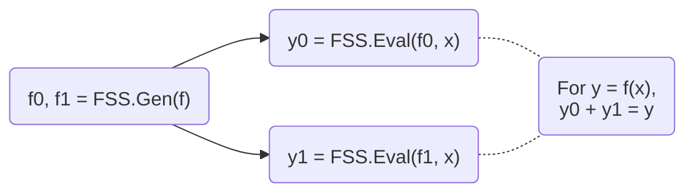

# myl7/fss

Function secret sharing (FSS) primitives including:

- 2-party distributed point function (DPF), based on [Boyle et al. (CCS '16)](https://doi.org/10.1145/2976749.2978429) or [Half-Tree (EUROCRYPT '23)](https://doi.org/10.1007/978-3-031-30545-0_12).
- 2-party distributed comparison function (DCF), based on [Boyle et al. (EUROCRYPT '21)](https://doi.org/10.1007/978-3-030-77886-6_30) or [Grotto (CCS '23)](https://doi.org/10.1145/3576915.3623147).
- 2-party verifiable distributed point function (VDPF), based on [Castro & Polychroniadou (EUROCRYPT '22)](https://doi.org/10.1007/978-3-031-06944-4_6).
- 2-party verifiable distributed multi-point function (VDMPF), based on [Castro & Polychroniadou (EUROCRYPT '22)](https://doi.org/10.1007/978-3-031-06944-4_6).
- 2-pary distributed multi-point function (DMPF), the non-verifiable counterpart of VDMPF.

[Documentation](https://myl7.github.io/fss/)

Features:

- First-class support for GPU (based on CUDA)
- Top-tier performance shown by benchmarks
- Well-commented and documented
- Header-only library, easy for integration

## Introduction

**Multi-party computation (MPC)** is a subfield of cryptography that aims to enable a group of parties (e.g., servers) to jointly compute a function over their inputs while keeping the inputs private.

**Secret sharing** is a method that distributes a secret among a group of parties, such that no individual party holds any information about the secret.
For example, a number $x$ can be secret-shared into $x_0, x_1$ via $x = x_0 + x_1$.

**FSS** is a scheme to secret-share a function into a group of function shares.
Each function share, called as a **key**, can be individually evaluated on a party.
The outputs of the keys are the shares of the original function output.
FSS consists of 2 methods: `Gen` for generating function shares as keys and `Eval` for evaluating a key to get an output share.
FSS's workflow is shown below:



**DPF/DCF** are FSS for point/comparison functions.
They are called out because 2-party DPF/DCF can have $O(\log N)$ key size, where $N$ is the input domain size.
Meanwhile, 3-or-more-party DPF/DCF and general FSS have $O(\sqrt{N})$ key size.
More details, including the definitions and the implementation details that users must care about, can be found in the documentation of dpf.cuh and dcf.cuh files.

## Get Started

### Prerequisites

- CMake >= 3.22
- CUDA toolkit >= 12.0 (for C++20 support). Tested on the latest CUDA toolkit.
- OpenSSL 3 (only required for CPU with AES-128 MMO PRG)

### Build

Clone the repository:

```bash
git clone https://github.com/myl7/fss.git
cd fss
```

**Option A: Install via CMake and use `find_package`**

```bash
cmake -B build -DBUILD_TESTING=OFF -DCMAKE_INSTALL_PREFIX=/path/to/install
cmake --build build
cmake --install build
```

Then in your project's `CMakeLists.txt`:

```cmake
find_package(fss REQUIRED)
target_link_libraries(your_target fss::fss)
```

When configuring your project, point CMake to the install prefix:

```bash
cmake -B build -DCMAKE_PREFIX_PATH=/path/to/install
```

**Option B: Use as a subdirectory (header-only)**

Without installing, you can define the target directly in your `CMakeLists.txt`, like the samples do:

```cmake
add_library(fss INTERFACE)
target_include_directories(fss INTERFACE "/path/to/fss/include")
target_compile_features(fss INTERFACE cxx_std_20 cuda_std_20)
```

Then link it in your project:

```cmake
target_link_libraries(your_target fss)
```

### CPU

This walks through using DPF and DCF on the CPU with AES-128 MMO PRG. This PRG requires OpenSSL.

1. Include the headers and set up type aliases:

   ```cpp
   #include <fss/dpf.cuh>
   #include <fss/dcf.cuh>
   #include <fss/group/bytes.cuh>
   #include <fss/prg/aes128_mmo.cuh>

   constexpr int kInBits = 8;  // Input domain: 2^8 = 256 values
   using In = uint8_t;
   using Group = fss::group::Bytes;

   // DPF uses mul=2, DCF uses mul=4
   using DpfPrg = fss::prg::Aes128Mmo<2>;
   using DcfPrg = fss::prg::Aes128Mmo<4>;
   using Dpf = fss::Dpf<kInBits, Group, DpfPrg, In>;
   using Dcf = fss::Dcf<kInBits, Group, DcfPrg, In>;
   ```

2. Create the PRG with AES keys and instantiate DPF/DCF:

   ```cpp
   // DPF PRG needs 2 AES keys
   unsigned char key0[16] = {1, 2, 3, 4, 5, 6, 7, 8, 9, 10, 11, 12, 13, 14, 15, 16};
   unsigned char key1[16] = {16, 15, 14, 13, 12, 11, 10, 9, 8, 7, 6, 5, 4, 3, 2, 1};
   const unsigned char *keys[2] = {key0, key1};
   auto ctxs = DpfPrg::CreateCtxs(keys);

   DpfPrg prg(ctxs);
   Dpf dpf{prg};
   ```

3. Run `Gen` to generate correction words (keys) from secret inputs:

   ```cpp
   In alpha = 42;                  // Secret point / threshold
   int4 beta = {7, 0, 0, 0};      // Secret payload (LSB of .w must be 0)

   // Random seeds for the two parties (LSB of .w must be 0)
   int4 seeds[2] = {
       {0x11111111, 0x22222222, 0x33333333, 0x44444440},
       {0x55555555, 0x66666666, 0x77777777, static_cast<int>(0x88888880u)},
   };

   Dpf::Cw cws[kInBits + 1];
   dpf.Gen(cws, seeds, alpha, beta);
   ```

4. Run `Eval` on each party and reconstruct using the group:

   ```cpp
   // Each party evaluates independently
   int4 y0 = dpf.Eval(false, seeds[0], cws, alpha);
   int4 y1 = dpf.Eval(true, seeds[1], cws, alpha);

   // Reconstruct via the group: convert to group elements, add, convert back
   // For Bytes group this is XOR; for Uint group this is arithmetic addition
   int4 sum = (Group::From(y0) + Group::From(y1)).Into();
   // sum == beta at x == alpha, 0 otherwise
   ```

5. Free the AES contexts when done:

   ```cpp
   DpfPrg::FreeCtxs(ctxs);
   ```

DCF follows the same pattern — use `DcfPrg` (mul=4, needs 4 AES keys), `Dcf`, and `Dcf::Cw`. The reconstructed output equals `beta` when `x < alpha` and `0` otherwise.

Link with OpenSSL in your `CMakeLists.txt`:

```cmake
find_package(OpenSSL REQUIRED)
target_link_libraries(your_target fss OpenSSL::Crypto)
```

See `samples/dpf_dcf_cpu.cu` for the complete working example.

### GPU

This walks through using DPF and DCF on the GPU with ChaCha PRG.

1. Include the headers and set up type aliases:

   ```cpp
   #include <fss/dpf.cuh>
   #include <fss/dcf.cuh>
   #include <fss/group/bytes.cuh>
   #include <fss/prg/chacha.cuh>

   constexpr int kInBits = 8;
   using In = uint8_t;
   using Group = fss::group::Bytes;

   // DPF uses mul=2, DCF uses mul=4
   using DpfPrg = fss::prg::ChaCha<2>;
   using DcfPrg = fss::prg::ChaCha<4>;
   using Dpf = fss::Dpf<kInBits, Group, DpfPrg, In>;
   using Dcf = fss::Dcf<kInBits, Group, DcfPrg, In>;
   ```

2. Set up a nonce in constant memory and create the PRG in a kernel:

   ```cpp
   __constant__ int kNonce[2] = {0x12345678, 0x9abcdef0};

   __global__ void GenKernel(Dpf::Cw *cws, const int4 *seeds, const In *alphas, const int4 *betas) {
       int tid = blockIdx.x * blockDim.x + threadIdx.x;

       DpfPrg prg(kNonce);
       Dpf dpf{prg};

       int4 s[2] = {seeds[tid * 2], seeds[tid * 2 + 1]};
       dpf.Gen(cws + tid * (kInBits + 1), s, alphas[tid], betas[tid]);
   }
   ```

3. Prepare host data, copy to device, and launch the `Gen` kernel:

   ```cpp
   int4 *d_seeds = /* cudaMalloc + cudaMemcpy seeds to device */;
   In *d_alphas = /* cudaMalloc + cudaMemcpy alphas to device */;
   int4 *d_betas = /* cudaMalloc + cudaMemcpy betas to device */;

   Dpf::Cw *d_cws;
   cudaMalloc(&d_cws, sizeof(Dpf::Cw) * (kInBits + 1) * N);

   GenKernel<<<blocks, threads>>>(d_cws, d_seeds, d_alphas, d_betas);
   ```

4. Write and launch an `Eval` kernel for each party, then copy results back:

   ```cpp
   __global__ void EvalKernel(int4 *ys, bool party, const int4 *seeds, const Dpf::Cw *cws, const In *xs) {
       int tid = blockIdx.x * blockDim.x + threadIdx.x;

       DpfPrg prg(kNonce);
       Dpf dpf{prg};

       ys[tid] = dpf.Eval(party, seeds[tid], cws + tid * (kInBits + 1), xs[tid]);
   }

   // Launch for party 0 and party 1, then copy d_ys back to host
   EvalKernel<<<blocks, threads>>>(d_ys, false, d_seeds0, d_cws, d_xs);
   EvalKernel<<<blocks, threads>>>(d_ys, true, d_seeds1, d_cws, d_xs);
   ```

5. Reconstruct on the host using the group, same as the CPU case:

   ```cpp
   int4 sum = (Group::From(h_y0s[i]) + Group::From(h_y1s[i])).Into();
   ```

DCF follows the same pattern — use `DcfPrg` (mul=4), `Dcf`, and `Dcf::Cw`.

See `samples/dpf_dcf_gpu.cu` for the complete working example.

### Samples

`samples/` holds a standalone program per scheme. They form their own CMake project:

```bash
cmake -B build/samples -S samples
cmake --build build/samples
```

| Sample                 | Scheme        | Shows                                                                |
| ---------------------- | ------------- | -------------------------------------------------------------------- |
| `dpf_dcf_cpu.cu`       | DPF, DCF      | Host `Gen`/`Eval` with AES-128 MMO PRG                               |
| `dpf_dcf_gpu.cu`       | DPF, DCF      | `Gen`/`Eval` inside CUDA kernels with ChaCha PRG                     |
| `half_tree_dpf_cpu.cu` | Half-Tree DPF | `Gen`/`Eval`/`EvalAll` with a mul=1 PRG and a separate hash key      |
| `grotto_dcf_cpu.cu`    | Grotto DCF    | `Gen`/`Preprocess`/`Eval` over a parity segment tree, plus `EvalAll` |
| `vdpf_cpu.cu`          | VDPF          | `Gen`/`Eval` plus the `Prove`/`Verify` check                         |
| `vdmpf_cpu.cu`         | VDMPF         | `Gen`/`BatchEval` over cuckoo-hash packed points                     |
| `dmpf_cpu.cu`          | DMPF          | `Gen`/`BatchEval` over cuckoo-hash packed points, without verification

The CPU samples link OpenSSL, and `EvalAll` uses OpenMP when it is found.

### Python

The `fss_crypto` package exposes PyTorch wrappers for DPF and DCF. It is
published on PyPI as `fss-crypto`.

Install it with pip:

```bash
pip install fss-crypto
```

Or add it to a uv project:

```bash
uv add fss-crypto
```

The package requires Python >= 3.13 and PyTorch >= 2.6. The first use of each
parameter set JIT-compiles a small CUDA extension with
`torch.utils.cpp_extension.load`, so the CUDA toolkit is required even when the
example below runs on CPU tensors. The `aes128_mmo` PRG also links OpenSSL at
JIT time. Compiled extensions are cached under `~/.cache/fss_crypto`.

To develop against a checkout instead, install the dev extra and run the tests:

```bash
uv sync --extra dev
uv run pytest
```

```python
import torch
import fss_crypto

dpf = fss_crypto.Dpf(in_bits=8, group="bytes", prg="chacha")

s0s = torch.tensor(
    [
        [0x11111111, 0x22222222, 0x33333333, 0x44444440],
        [0x55555555, 0x66666666, 0x77777777, -0x77777780],
    ],
    dtype=torch.int32,
)
beta = torch.tensor([7, 0, 0, 0], dtype=torch.int32)

cws = dpf.gen(s0s, alpha=42, beta=beta)
y0 = dpf.eval(party=0, s0=s0s[0], cws=cws, x=42)
y1 = dpf.eval(party=1, s0=s0s[1], cws=cws, x=42)

assert torch.bitwise_xor(y0, y1).equal(beta)
```

`gen` and `eval_all` are CPU-only. `eval` can run on CUDA tensors for ChaCha
PRG when CUDA is available. The JIT path sets a default `TORCH_CUDA_ARCH_LIST`
on machines with no visible GPU so CPU tests can still compile the extension.

### Compiler Warnings

You may see warnings like "integer constant is so large that it is unsigned" during compilation. These cannot be easily suppressed but are harmless and can be safely ignored.

### nvcc 12.8: `Uint` as a `__global__` kernel template argument

nvcc 12.8 fails to compile the stub file when `fss::group::Uint<__uint128_t, ...>` is used as a template argument to a `__global__` kernel — it emits a 128-bit integer literal that g++ cannot parse. `__device__` functions are not affected (no stub is generated for them).

Workaround: wrap the type in a plain aggregate struct that satisfies `Groupable` but has no `__uint128_t` non-type template parameter in its name. The struct must have no user-declared constructors to remain an aggregate. See `third_party/fss/bench.cu` for an example.

## Benchmarks

Microbenchmarks built on [Google Benchmark](https://github.com/google/benchmark), covering:

- Schemes: DPF, DCF, VDPF, Half-Tree DPF, and Grotto DCF.
- Operations: `Gen`, `Eval`, host `EvalAll`, VDPF `Prove`, Grotto DCF `Preprocess` and `PreprocessEvalAll`, GPU point eval, and full-domain GPU `EvalAll`.
- PRGs: AES-128 MMO over OpenSSL, AES-128 MMO over AES-NI intrinsics, software AES-128 MMO, and ChaCha. The CPU benchmarks cover all four. The GPU benchmarks cover ChaCha and software AES-128 MMO, the two that run on device.
- Output groups: `Uint` and `Bytes`.
- VDPF hashes: SHA-256 and BLAKE3.
- Input domain sizes: 2^20 everywhere, plus 2^14 and 2^17 for DPF `Eval`.

Configure with `BUILD_BENCH=ON` and build the targets:

```bash
cmake -B build -DBUILD_BENCH=ON -DCMAKE_BUILD_TYPE=RelWithDebInfo
cmake --build build --target bench_cpu bench_gpu
```

Run all benchmarks:

```bash
./build/bench_cpu
./build/bench_gpu
```

Run a subset using `--benchmark_filter` (regex):

```bash
./build/bench_cpu --benchmark_filter=BM_DcfGen
./build/bench_cpu --benchmark_filter=BM_DpfEval_Uint_Aes/20
```

The `Makefile` has shortcuts for the same runs. `make bench_cpu` pins the run to
one core and switches that core to the performance governor, which needs
`sudo`. `make bench_gpu` pins the run to one GPU. Both write their log under
`build/`.

```bash
CPU_ID=0 make bench_cpu
GPU_ID=1 CUDA_ARCH=120 make bench_gpu
```

`CUDA_ARCH` is only needed when CMake cannot infer the architecture. Two more
targets support the sections below: `make ptx_info` rebuilds with
`--ptxas-options=-v` and collects the register usage into `build/ptx_info.log`,
and `make profile_gpu` records an Nsight Systems profile of one benchmark
selected by `GPU_PROFILE_BENCH`.

### CPU Results

Run on Intel Xeon Platinum 8352V @ 2.10GHz (Ice Lake), single core, pinned with `taskset -c 0`. The host is shared and runs the schedutil cpufreq governor, so the effective single-core clock varies with host load (observed 0.8-3.5 GHz). Per-key rows run one op per iteration, so `Avg per item` equals `Time` and `Items/s` counts keys. `EvalAll` rows process 2^20 outputs per iteration, so their `Items/s` counts outputs and `Avg per item` is its reciprocal.

| Benchmark                            | PRG               | Time     | Avg per item | Items/s  |
| ------------------------------------ | ----------------- | -------- | ------------ | -------- |
| BM_DpfEval_Uint_Aes/20               | `Aes128Mmo<2>`    | 1078 ns  | 1078 ns      | 927.6k/s |
| BM_DpfEval_Uint_Aes/14               | `Aes128Mmo<2>`    | 751 ns   | 751 ns       | 1.332M/s |
| BM_DpfEval_Uint_Aes/17               | `Aes128Mmo<2>`    | 931 ns   | 931 ns       | 1.074M/s |
| BM_DpfGen_Uint_Aes/20                | `Aes128Mmo<2>`    | 2272 ns  | 2272 ns      | 440.1k/s |
| BM_DpfEval_Bytes_Aes/20              | `Aes128Mmo<2>`    | 1076 ns  | 1076 ns      | 929.4k/s |
| BM_DpfEvalAll_Uint_Aes/20            | `Aes128Mmo<2>`    | 78.7 ms  | 74.9 ns      | 13.34M/s |
| BM_DpfEval_Uint_ChaCha/20            | `ChaCha<2>`       | 3823 ns  | 3823 ns      | 261.6k/s |
| BM_DpfEval_Uint_AesSoft/20           | `Aes128Soft<2>`   | 4094 ns  | 4094 ns      | 244.3k/s |
| BM_DpfEval_Uint_AesRaw/20            | `Aes128MmoRaw<2>` | 333 ns   | 333 ns       | 3.003M/s |
| BM_DpfEval_Bytes_AesRaw/20           | `Aes128MmoRaw<2>` | 345 ns   | 345 ns       | 2.899M/s |
| BM_DpfGen_Uint_AesRaw/20             | `Aes128MmoRaw<2>` | 463 ns   | 463 ns       | 2.160M/s |
| BM_DpfGen_Bytes_AesRaw/20            | `Aes128MmoRaw<2>` | 428 ns   | 428 ns       | 2.336M/s |
| BM_DcfEval_Uint_AesRaw/20            | `Aes128MmoRaw<4>` | 343 ns   | 343 ns       | 2.915M/s |
| BM_DcfEval_Bytes_AesRaw/20           | `Aes128MmoRaw<4>` | 412 ns   | 412 ns       | 2.427M/s |
| BM_DcfGen_Uint_AesRaw/20             | `Aes128MmoRaw<4>` | 645 ns   | 645 ns       | 1.550M/s |
| BM_DcfGen_Bytes_AesRaw/20            | `Aes128MmoRaw<4>` | 698 ns   | 698 ns       | 1.433M/s |
| BM_DcfEval_Uint_Aes/20               | `Aes128Mmo<4>`    | 1481 ns  | 1481 ns      | 675.2k/s |
| BM_DcfGen_Uint_Aes/20                | `Aes128Mmo<4>`    | 3264 ns  | 3264 ns      | 306.4k/s |
| BM_DcfEval_Bytes_Aes/20              | `Aes128Mmo<4>`    | 1772 ns  | 1772 ns      | 564.3k/s |
| BM_DcfEvalAll_Uint_Aes/20            | `Aes128Mmo<4>`    | 97.8 ms  | 93.2 ns      | 10.73M/s |
| BM_DcfEvalAll_Bytes_Aes/20           | `Aes128Mmo<4>`    | 98.6 ms  | 93.9 ns      | 10.64M/s |
| BM_VdpfEval_Uint_Aes_Sha256/20       | `Aes128Mmo<2>`    | 2499 ns  | 2499 ns      | 400.2k/s |
| BM_VdpfGen_Uint_Aes_Sha256/20        | `Aes128Mmo<2>`    | 4146 ns  | 4146 ns      | 241.2k/s |
| BM_VdpfEval_Uint_Aes_Blake3/20       | `Aes128Mmo<2>`    | 1437 ns  | 1437 ns      | 695.9k/s |
| BM_VdpfProve_Uint_ChaCha_Blake3/20   | `ChaCha<2>`       | 181 ns   | 181 ns       | 5.525M/s |
| BM_VdpfEvalAll_Uint_Aes_Sha256/20    | `Aes128Mmo<2>`    | 2138 ms  | 2037 ns      | 491k/s   |
| BM_HalfTreeDpfEval_Uint_Aes/20       | `Aes128Mmo<1>`    | 1017 ns  | 1017 ns      | 983.3k/s |
| BM_HalfTreeDpfGen_Uint_Aes/20        | `Aes128Mmo<1>`    | 2236 ns  | 2236 ns      | 447.2k/s |
| BM_HalfTreeDpfEvalAll_Uint_Aes/20    | `Aes128Mmo<1>`    | 86.9 ms  | 82.8 ns      | 12.08M/s |
| BM_GrottoDcfEval_Aes/20              | `Aes128Mmo<2>`    | 17.0 ns  | 17.0 ns      | 58.82M/s |
| BM_GrottoDcfPreprocess_Aes/20        | `Aes128Mmo<2>`    | 57.7 ms  | —            | —        |
| BM_GrottoDcfPreprocessEvalAll_Aes/20 | `Aes128Mmo<2>`    | 119.9 ms | 114.2 ns     | 8.758M/s |

### GPU Results

Run on NVIDIA RTX PRO 5000 (72GB VRAM, Blackwell, sm_120), CUDA 13.2, driver 595.71.05. The host is shared: the GPU boost clock varies with host state (observed 180-2355 MHz). Each iteration runs 1M (2^20) keys in parallel. `Time` is the whole batch. `Avg per item` is the reciprocal of `Items/s`: per key for `Eval`/`Gen`/point-eval rows, per output for `EvalAll` rows (2^40 outputs per iteration).

| Benchmark                                 | PRG             | Time      | Avg per item | Items/s  |
| ----------------------------------------- | --------------- | --------- | ------------ | -------- |
| BM_DpfEval_Uint_ChaCha/20                 | `ChaCha<2>`     | 1398.8 µs | 1.334 ns     | 749.6M/s |
| BM_DpfEval_Uint_ChaCha/14                 | `ChaCha<2>`     | 765.7 µs  | 0.730 ns     | 1.369G/s |
| BM_DpfEval_Uint_ChaCha/17                 | `ChaCha<2>`     | 956.8 µs  | 0.912 ns     | 1.096G/s |
| BM_DpfGen_Uint_ChaCha/20                  | `ChaCha<2>`     | 1965.4 µs | 1.874 ns     | 533.5M/s |
| BM_DpfEval_Bytes_ChaCha/20                | `ChaCha<2>`     | 1398.9 µs | 1.334 ns     | 749.6M/s |
| BM_DpfEval_Uint_AesSoft/20                | `Aes128Soft<2>` | 3087.5 µs | 2.944 ns     | 339.6M/s |
| BM_DcfEval_Uint_ChaCha/20                 | `ChaCha<4>`     | 1421.2 µs | 1.355 ns     | 737.8M/s |
| BM_DcfGen_Uint_ChaCha/20                  | `ChaCha<4>`     | 1969.1 µs | 1.878 ns     | 532.5M/s |
| BM_VdpfEval_Uint_ChaCha_Blake3/20         | `ChaCha<2>`     | 1241.3 µs | 1.184 ns     | 844.7M/s |
| BM_VdpfGen_Uint_ChaCha_Blake3/20          | `ChaCha<2>`     | 2132.2 µs | 2.033 ns     | 491.8M/s |
| BM_HalfTreeDpfEval_Uint_ChaCha/20         | `ChaCha<1>`     | 1001.7 µs | 0.955 ns     | 1.047G/s |
| BM_HalfTreeDpfGen_Uint_ChaCha/20          | `ChaCha<1>`     | 1961.5 µs | 1.871 ns     | 534.6M/s |
| BM_DpfEvalAllGpu_Uint_ChaCha/20           | `ChaCha<2>`     | 71.3 s    | 64.8 ps      | 15.43G/s |
| BM_HalfTreeDpfEvalAllGpu_Uint_ChaCha/20   | `ChaCha<1>`     | 90.9 s    | 82.7 ps      | 12.09G/s |
| BM_DpfEvalPointGpu_Uint_ChaCha/20         | `ChaCha<2>`     | 1024.5 µs | 0.977 ns     | 1.024G/s |
| BM_DcfEvalPointGpu_Uint_ChaCha/20         | `ChaCha<4>`     | 1120.6 µs | 1.069 ns     | 935.7M/s |
| BM_HalfTreeDpfEvalPointGpu_Uint_ChaCha/20 | `ChaCha<1>`     | 1000.9 µs | 0.955 ns     | 1.048G/s |
| BM_VdpfEvalPointGpu_Uint_ChaCha_Blake3/20 | `ChaCha<2>`     | 1109.2 µs | 1.058 ns     | 945.3M/s |

GPU kernel register usage (compiled for sm_120, `--ptxas-options=-v`):

| Kernel               | Group | PRG             | Registers | Stack | Smem  |
| -------------------- | ----- | --------------- | --------- | ----- | ----- |
| DpfEval              | Uint  | `ChaCha<2>`     | 39        |       |       |
| DpfEval              | Bytes | `ChaCha<2>`     | 40        |       |       |
| DpfGen               | Uint  | `ChaCha<2>`     | 43        |       |       |
| DpfGen               | Bytes | `ChaCha<2>`     | 48        |       |       |
| DpfEval              | Uint  | `Aes128Soft<2>` | 80        | 624B  | 2304B |
| DpfGen               | Uint  | `Aes128Soft<2>` | 80        | 624B  | 2304B |
| HalfTreeDpfEval      | Uint  | `ChaCha<1>`     | 40        |       |       |
| HalfTreeDpfGen       | Uint  | `ChaCha<1>`     | 46        |       |       |
| VdpfEval             | Uint  | `ChaCha<2>`     | 40        |       |       |
| VdpfGen              | Uint  | `ChaCha<2>`     | 79        |       |       |
| DcfEval              | Uint  | `ChaCha<4>`     | 42        |       |       |
| DcfGen               | Uint  | `ChaCha<4>`     | 50        |       |       |
| DpfEvalAll           | Uint  | `ChaCha<2>`     | 55        |       | 5120B |
| HalfTreeDpfEvalAll   | Uint  | `ChaCha<1>`     | 55        |       | 5120B |
| DpfEvalPoint         | Uint  | `ChaCha<2>`     | 39        |       |       |
| DcfEvalPoint         | Uint  | `ChaCha<4>`     | 46        |       |       |
| VdpfEvalPoint        | Uint  | `ChaCha<2>`     | 40        |       |       |
| HalfTreeDpfEvalPoint | Uint  | `ChaCha<1>`     | 38        |       |       |

The PRG drives most of the difference. Software AES-128 MMO costs about twice the registers of ChaCha for the same scheme and group, and it is the only backend here that spills to stack and holds a T-table in shared memory. The `mul` parameter is part of the PRG type because it sets how many 16B blocks one `Gen` call produces. The `EvalAll` kernels use shared memory for per-block staging. Every kernel other than the two software-AES ones has zero spills.

### Flamegraph

Generate a CPU flamegraph with `perf` and [FlameGraph](https://github.com/brendangregg/FlameGraph):

```bash
perf record -g ./build/bench_cpu --benchmark_filter=BM_DpfEval_Uint_Aes/20
perf script | /path/to/FlameGraph/stackcollapse-perf.pl | /path/to/FlameGraph/flamegraph.pl > build/flamegraph.svg
```

`make flamegraph` runs the same steps, taking the FlameGraph checkout from
`FLAMEGRAPH_DIR` (default `../FlameGraph`) and the benchmark from
`FLAMEGRAPH_BENCH`:

```bash
FLAMEGRAPH_DIR=/path/to/FlameGraph FLAMEGRAPH_BENCH=BM_DcfGen_Uint_Aes/20 make flamegraph
```

Open `build/flamegraph.svg` in a browser. The graph is interactive: click a frame to zoom in.

## License

Apache License, Version 2.0

Copyright (C) 2026 Yulong Ming <i@myl7.org>
